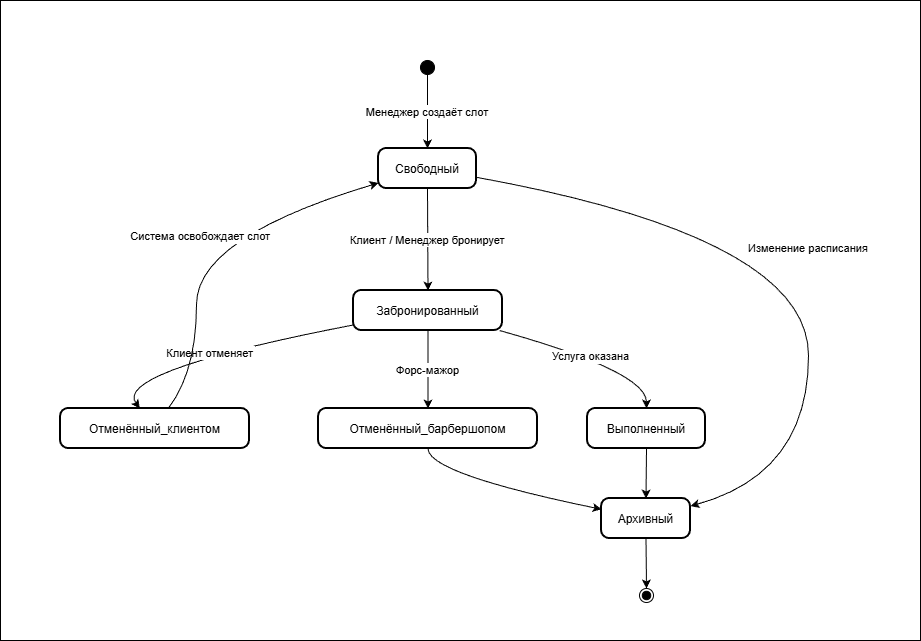

# BSA10_FR-Design

Проект по проектированию функциональных требований для системы онлайн-записи барбершопа (BRB): статусные модели, CRUD-операции, права доступа ролей.

## 🛠 Навыки
- State Machine (Lifecycle)
- CRUD Matrix
- Access Control (RBAC)
- Functional Requirements Specification
- Object Lifecycle Analysis

## 📋 Описание проекта
В ходе работы я разработала детальные функциональные требования для системы онлайн-записи барбершопа: описала жизненные циклы ключевых объектов, определила CRUD-операции и права доступа для каждой роли.

### Что именно было сделано:
1. **Выделение объектов со статусной моделью (ex00)**: Выявила сущности, требующие отслеживания жизненного цикла: «Слоты обслуживания», «Клиенты», «Сотрудники», «Роли сотрудника», «Услуги», «Услуги мастера». Обосновала выбор и добавила атрибут «Статус».
2. **Жизненный цикл «Слоты обслуживания» (ex01)**: Разработала статусную модель слота (Свободный → Забронированный → Выполненный / Отменённый_клиентом / Отменённый_барбершопом → Архивный). Построила диаграмму состояний с указанием исполнителей, действий и условий.
3. **Статусные модели остальных сущностей (ex02)**: Создала таблицы состояний для Клиентов, Сотрудников, Ролей, Услуг и Услуг мастера с описанием исходного состояния, инициатора, действия, условий и следующего состояния.
4. **Описание действий над справочниками (ex03)**: Для каждого справочника (Клиенты, Сотрудники, Роли, Услуги, Услуги мастера) указала CRUD-операции с ролями, UC, условиями выполнения, подтверждением, журналированием и извещением.
5. **CRUD над объектом «Слоты обслуживания» (ex04)**: Определила основные действия (создание, чтение, редактирование, удаление, бронирование, отмена, отметка выполнения) с указанием ролей и привязкой к UC.
6. **Детализация действий над слотами (ex05)**: Дополнила таблицу формой визуализации (список/календарь/карточка), подтверждением, откатом, сортировкой, фильтром, поиском, логированием и отправкой сообщений.
7. **Права доступа ролей (ex06)**: Составила матрицу прав доступа (CRUD) для всех объектов по ролям: Менеджер, Мастер, Клиент, Администратор. Указала условия, извещения и журналирование.

## 🔍 Пример диаграммы состояний

Ниже показана диаграмма жизненного цикла объекта «Слот обслуживания».

## 📂 Файлы
Все рабочие материалы проекта находятся в репозитории выше:
- [BRB/](./BRB/) — аналитика по проекту барбершопа (онлайн-запись) – включает статусные модели, CRUD, права доступа.
- [DLV/](./DLV/) — аналитика по проекту доставки (курьерская служба) – в данном проекте не заполнена (задание по DLV не выполнялось).
